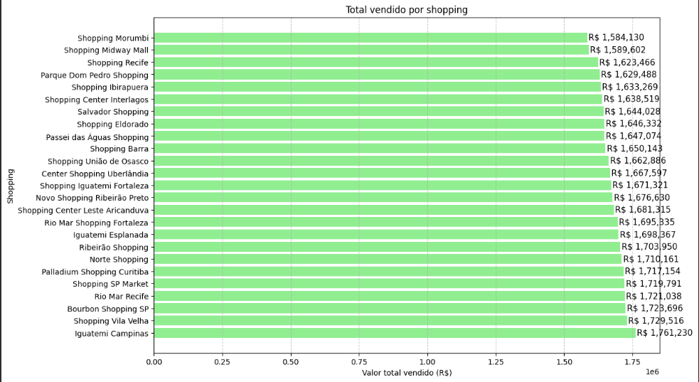
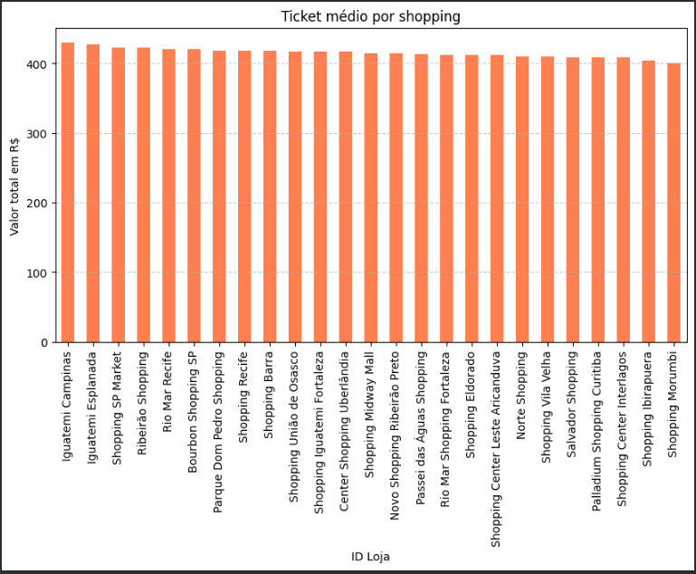
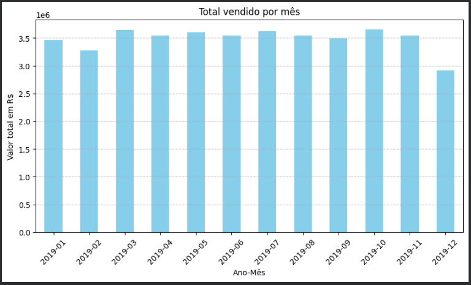

# 🛒 Mini Projeto 1: Análise de Vendas em Shoppings

## 💡 Sobre o projeto

Este é o **meu primeiro mini projeto de Ciência de Dados**, feito como parte do meu aprendizado **autodidata**.  
O objetivo foi praticar análise exploratória de dados (EDA) usando Python, explorando informações de vendas em diferentes shoppings ao longo do ano.

---

## 🗂️ Dados utilizados

- 📁 **Vendas:** dados de vendas até novembro e dados de dezembro, totalizando mais de 100 mil registros após concatenação.
- 📁 **Gerentes:** dados com o responsável por cada loja.

As tabelas foram processadas e unificadas no pandas para facilitar as análises.

---

## ⚙️ Tecnologias usadas

- Python
- Pandas
- Matplotlib
- Google Colab
- GitHub para versionamento e portfólio

---

## 🔍 Principais análises realizadas

✅ Total vendido por shopping  
✅ Ticket médio por shopping  
✅ Produto mais caro vendido  
✅ Total vendido por mês

---

## 📈 Gráficos e insights

### 🏬 Total vendido por shopping

### 💰 Ticket médio por shopping

### 📅 Total vendido por mês

---

## 🚀 Como executar

1. baixe o arquivo `mini_projeto_1_vendas.ipynb`.
2. Abra no Google Colab ou Jupyter Notebook.
3. Execute todas as células em sequência para reproduzir os resultados.

---

## 🚀 Observação final

Este projeto faz parte do meu **portfólio de estudos**, focando no desenvolvimento prático das minhas habilidades.
